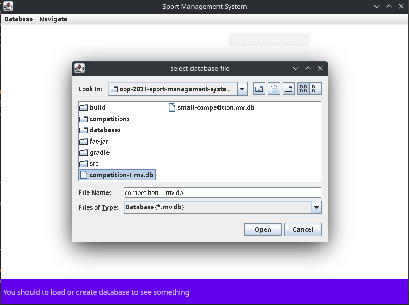
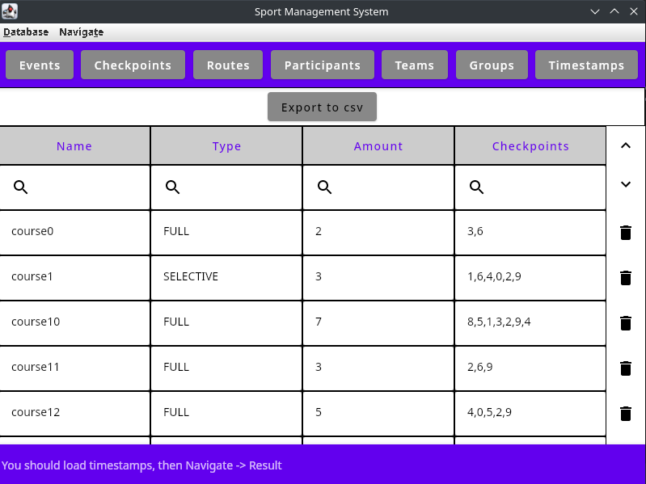
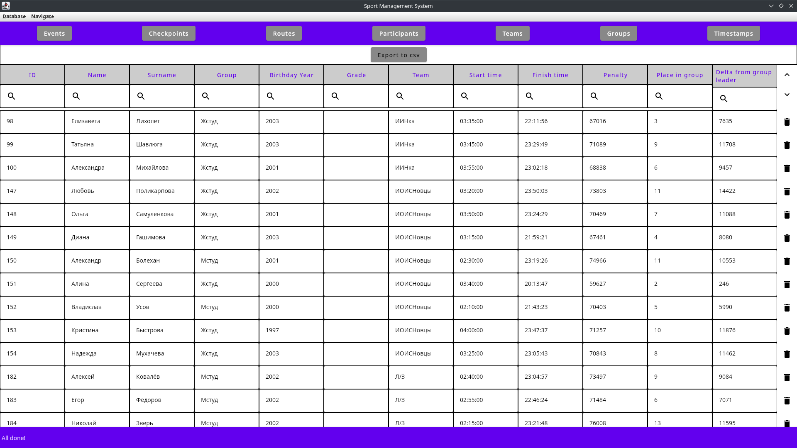
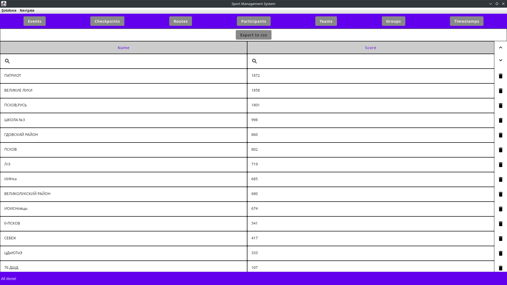

# Система для проведения спортивных соревнований

## Описание предметной области

Предположим вам необходимо реализовать систему организации для спортивных соревнований в одном из циклических видов
спорта: бег, беговые лыжи, плаванье, велоспорт, спортивное ориентирование и т.п.

В простейшем случае соревнования имеют какое-то название, дату проведения, и подразумевают прохождение каждым
спортсменом какой-то одной дистанции.

Все спортсмены выступают в разных группах в зависимости от пола и возраста. Список групп определяется регламентом
соревнований и публикуется заранее.

У каждой группы своя дистанция, при этом у некоторых групп могут быть одинаковые дистанции.

Спортсмены выступают за разные коллективы, каждый коллектив подаёт заявочные списки, в которых указывает для спортсменов
фамилию, имя, год рождения, спортивный разряд, желаемую группу. Также в заявочных списках указываются данные о
медицинском осмотре и страховке от несчастного случая для каждого спортсмена.

На основании всех заявочных списков для каждой группы формируется протокол старта. Протокол формируется в результате
жеребьёвки. Каждый спортсмен получает индивидуальный нагрудный номер и время старта. Старт может быть общим (в одно
время) или раздельным. В простейшем случае жеребьёвка расставляет всех спортсменов в группе в случайном порядке. Однако
могут быть более сложные виды жеребьёвки, например когда нужно учитывать разряд, учитывать забег внутри группы,
учитывать одновременный старт разных групп.

После прохождения соревнований формируется протокол результатов, а также протокол с промежуточными результатами
прохождения дистанции. Дистанция может состоять из нескольких контрольных пунктов, на каждом из которых фиксируется
время прохождения. Результат фиксируется либо вручную, либо с помощью одной или нескольких систем электронной отметки.
Соответственно результат предаётся в систему либо при ручном вводе, либо при получении данных от систем электронной
отметки. Это список вида <время> - <номер к/п> - <номер участника>.

В протоколах старта, финиша и пр. для каждого участника необходимо указать номер, имя, фамилию, год рождения, спортивный
разряд, коллектив. В стартовом протоколе дополнительно указывается время старта. В протоколе результатов указывается
итоговое место, результат (время затраченное на прохождение дистанции), Отставание от лидера и (опционально) выполненный
спортивный разряд. Выполненный спортивный разряд вычисляется по некоторой формуле, которая зависит от вида спорта,
группы и регламента конкретных соревнований. Кроме протокола результатов для каждой из групп формируется протокол
результатов для коллективов. При этом по определённой формуле, зависящей от регламента конкретных соревнований,
результат каждого спортсмена в его группе даёт определённое количество очков, которые в сумме дают результат коллектива.

Пример заявочного списка (CSV):

```csv
team1,,,,
Имя,Фамилия,Г.р.,Группа,Разр.
name0-team1,surname0,1992,М18,
name1-team1,surname1,1963,Ж20,
name2-team1,surname2,1959,М30,
name3-team1,surname3,1989,Ж30,
```

Пример протокола старта (CSV):

```csv
Номер,Имя,Фамилия,Группа,Год рождения,Разряд,Команда,Время старта
1,name0-team3,surname0,Ж80,1999,,team3,12:00:00
2,name1-team3,surname1,Ж26,1978,,team3,12:05:00
3,name2-team3,surname2,Ж50,1995,,team3,12:15:00
4,name3-team3,surname3,М50,1984,,team3,12:25:00
5,name4-team3,surname4,М14,1957,,team3,12:30:00
6,name0-team2,surname0,М40,1950,,team2,12:35:00
7,name1-team2,surname1,Ж26,1982,,team2,12:10:00
8,name2-team2,surname2,Ж50,1955,,team2,12:20:00
9,name0-team1,surname0,М18,1992,,team1,12:40:00
10,name1-team1,surname1,Ж20,1963,,team1,12:45:00
11,name2-team1,surname2,М30,1959,,team1,12:50:00
12,name3-team1,surname3,Ж30,1989,,team1,12:55:00
```

Пример протокола прохождения контрольного пункта (CSV):

```csv
0,
Номер,Время
1,21:44:14
3,21:58:36
5,19:23:54
8,20:10:53
9,22:29:29
12,15:32:19
```

Пример протокола результатов (CSV):

```csv
Номер,Имя,Фамилия,Группа,Год рождения,Разряд,Команда,Стартовое время,Финишное время,Штраф,Место в группе,Отставание от лидера
1,name0-team3,surname0,Ж80,1999,,team3,12:00:00,23:20:46,764236,1,0
2,name1-team3,surname1,Ж26,1978,,team3,12:05:00,19:48:01,27781,1,0
3,name2-team3,surname2,Ж50,1995,,team3,12:15:00,23:10:47,720627,2,46401
4,name3-team3,surname3,М50,1984,,team3,12:25:00,19:48:47,299554,1,0
5,name4-team3,surname4,М14,1957,,team3,12:30:00,19:23:54,24834,1,0
6,name0-team2,surname0,М40,1950,,team2,12:35:00,21:42:17,313948,1,0
7,name1-team2,surname1,Ж26,1982,,team2,12:10:00,20:44:06,30846,2,3065
8,name2-team2,surname2,Ж50,1955,,team2,12:20:00,23:32:19,674226,1,0
9,name0-team1,surname0,М18,1992,,team1,12:40:00,22:29:29,35369,1,0
10,name1-team1,surname1,Ж20,1963,,team1,12:45:00,23:51:40,434442,1,0
11,name2-team1,surname2,М30,1959,,team1,12:50:00,20:41:58,806681,1,0
12,name3-team1,surname3,Ж30,1989,,team1,12:55:00,22:09:40,780738,1,0
```

## Особенности программы

1. По заявочным спискам система формирует стартовые протоколы, использует простую жеребьёвку с интервалом 5 минут и
   началом старта в 12:00:00.
2. По стартовым протоколам и протоколам прохождения контрольных пунктов формирует протоколы результатов участников и
   протокол результатов для команд. Очки вычисляются по формуле max(0, 100 * (2 - <результат>/<результат победителя>)).
3. Проверяет корректность заявочных списков и корректность прохождения контрольных пунктов каждым из участников.
4. Графический интерфейс поддерживает несколько страниц (вкладок): список групп, список дистанций, список команд, список
   участников и список отметок участников на контрольных пунктах. Списки поддерживают возможность импорта (добавления)
   данных из CSV или ручного добавления/редактирования/удаления строк. Списки поддерживают фильтрацию/сортировку по
   разным колонкам.
5. Так же поддерживается "Экспорт результатов" для любой из вкладок.
6. Дистанции могут быть двух видов - дистанции, в которых участник обязан пробежать все контрольные пункты, и дистанции
   по выбору, в которых участник должен K контрольных пунктов из N доступных, где каждый пункт оценивается в свое число
   очков.
7. Поддерживается хранение данных в базе данных на любом этапе работы с системой.

## Скриншоты

+ Загрузка базы данных
  
+ Маршруты
  
+ Результаты участников
  
+ Результаты команд
  
